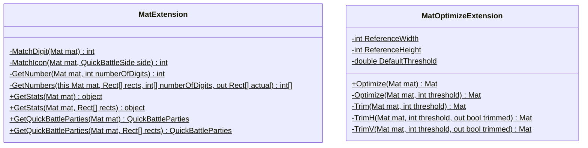
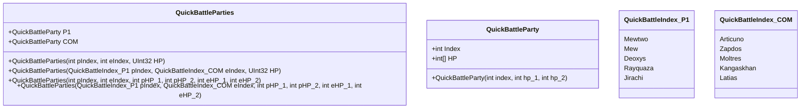

# PokemonXDImageLibrary

「ポケモンXD 闇の旋風ダーク・ルギア」用 画像認識関連ライブラリ

## Summary

OpenCvSharp.Matクラスを拡張して画像を確認させる。

内部でリファレンス画像と条件を揃えるため、利用者はアスペクト比や余白について考慮する必要がない。

- ステータス実数値
- いますぐバトル生成結果

## Diagram

### Structures

> GetStats returns (int HP, int Attack, int Defense, int Speed, int SpAtk, int SpDef)

## Note

- [テスト画像](https://drive.google.com/drive/folders/1VmbFF6gG3jAFbgS2-pjO5bKdyyW2Gfuk?usp=sharing)
- MatExtensionは `OpenCvSharp4` だけ参照させて、テストに `OpenCvSharp4.runtime.win` を参照させればライブラリはクロスプラットフォームになるはず...？
